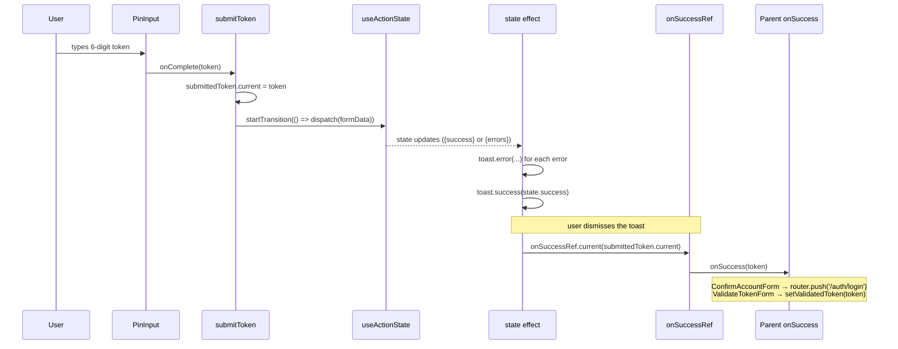

# Validation Token Workflow

1. `useValidateToken` is shared by two entry points: `ConfirmAccountForm` (confirms a new account) and `ValidateTokenForm` (first step of password reset). Each passes its own `serverAction` and `onSuccess`.

2. For password reset specifically: once the token is valid, `ValidateTokenForm` reports it up via `onSuccess`, `PasswordResetHandler` stores it and swaps in `ResetPasswordForm` with that token bound to the `resetPassword` action. Only after the new password is saved does it redirect to `/auth/login` — the token being *valid* and the password being *changed* are two separate success events.

3. A token can arrive two ways: from the email link (`?token=XXXXXX` in the URL, auto-submitted on mount) or typed manually into the `PinInput` (`onComplete`). Both paths funnel through the same `submitToken`.

## Page-level flow

```mermaid
flowchart TD
    subgraph confirm["Confirm account"]
        A1["/auth/confirm-account?token=..."] --> A2[ConfirmAccountForm]
        A2 -->|"serverAction: confirmAccount<br/>onSuccess: () => router.push('/auth/login')"| HookA[useValidateToken]
        HookA -->|success| LoginA[("/auth/login")]
    end

    subgraph reset["Reset password"]
        B1["/auth/forgot-password"] -->|submit email| B2[forgotPassword action]
        B2 --> B3[Backend emails link with token]
        B3 --> B4["/auth/new-password?token=..."]
        B4 --> B5[PasswordResetHandler<br/>state: validatedToken]
        B5 -->|"validatedToken === ''"| B6[ValidateTokenForm]
        B6 -->|"serverAction: validateToken<br/>onSuccess: onValidToken"| HookB[useValidateToken]
        HookB -->|"onValidToken(token)"| B5
        B5 -->|"validatedToken set"| B7["ResetPasswordForm token={validatedToken}"]
        B7 -->|submit new password| B8["resetPassword.bind(null, token)"]
        B8 --> B9["POST /auth/reset-password/:token"]
        B9 -->|success| LoginB[("/auth/login")]
    end
```

## Inside `useValidateToken` — why the refs matter

The token-entry effect and the state effect are two separate `useEffect`s that both need the *current* token and the *current* `onSuccess`, without re-running every time the parent re-renders with a new inline callback. That's why `submittedToken` and `onSuccessRef` exist — plain closures over `state`'s effect would either go stale or re-fire the toast on every render.

`onSuccessRef.current` is kept fresh by a separate effect with no dependency array (`useEffect(() => { onSuccessRef.current = onSuccess })`), so it always points at the latest `onSuccess` closure without being a dependency of the state effect — which is what would otherwise force `onSuccess` into that effect's deps and reopen the "toast refires because the parent passed a new arrow function" problem.
